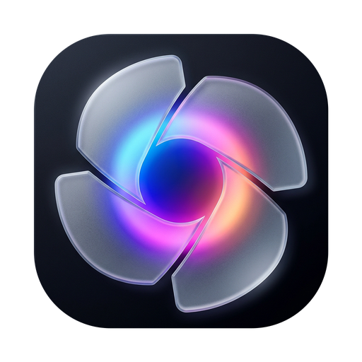

<div align="center">

  <h1>
     Bukaake
  </h1>

  <p>
    <strong>The ultra-fast, transparent, and distraction-free photo viewer for Windows.</strong><br />
    <em>Reviving the desktop-immersive magic of the classic Google Picasa Photo Viewer with modern stroke-free frosted glass.</em>
  </p>

  <p>
    <a href="https://github.com/Crlyzd/Bukaake/releases/latest"></a>
    <a href="https://github.com/Crlyzd/Bukaake/releases"></a>
    <a href="https://github.com/Crlyzd/Bukaake/releases"></a>
    <a href="https://github.com/Crlyzd/Bukaake/releases"></a>
    <a href="LICENSE"></a>
  </p>

  <p>
    <a href="https://github.com/Crlyzd/Bukaake/releases/latest">
      
    </a>
    &nbsp;
    <a href="https://github.com/Crlyzd/Bukaake/releases/latest">
      
    </a>
  </p>

  <br />

  

  <p align="center">
    <em>Pure transparent desktop immersion: softly dimmed wallpaper background, centered floating controls, and zero bulky borders.</em>
  </p>

</div>

<br />

---

## 💡 Why Bukaake?

Most photo viewers on Windows today are slow to launch, cluttered with heavy toolbars, or trap your pictures inside thick, distracting window frames. Some even force you to pay for extra codecs just to open photos from your iPhone!

**Bukaake** revives what made **Google Picasa Photo Viewer** so beloved, supercharged with modern Windows 10 & 11 design:

- 🪟 **Zero Distractions**: Truly borderless and translucent. Your desktop wallpaper stays softly dimmed in the background while your photo takes center stage.
- ⚡ **Auto-Hiding Controls**: Relax and enjoy your photos in peace. The second your mouse stops moving, all buttons and titles gently fade away.
- 🚀 **Instant Launch**: Opens in the blink of an eye and uses almost no RAM. A single ~5 MB portable file—no installation needed.
- 🖱️ **Smooth Navigation**: Zoom like butter with your mouse wheel right into the fine details, click-and-drag to pan, and flip effortlessly through folders with your arrow keys.
- 🗑️ **Stress-Free & Safe**: Send bad photos straight to your **Windows Recycle Bin** with `Delete`—easily restore them if you ever change your mind!
- 📸 **Built-in Snip & Record**: Take instant screenshots of any monitor or region, or record video clips right from the app with zero extra tools.

<br />

---

## ⚡ Highlights at a Glance

| Superpower | Why It Matters |
| :--- | :--- |
| 🪟 **Desktop-Immersive Transparency** | Translucent dimmed background lets your desktop show through without heavy borders. |
| ⚡ **Sub-10ms Launch & Standby** | Instant tray daemon with automatic memory trimming down to ~8–15 MB RAM. |
| 📷 **49+ Formats & Camera RAW** | Native iPhone HEIC/HEIF (100% free), 24+ RAW camera formats, and 3D VFX textures. |
| 📸 **Integrated Screen Snipper** | Multi-monitor crosshair capture with instant clipboard copy and auto-saved PNGs. |
| 🎥 **Desktop Screen Recording** | Floating frosted control dock streaming lightweight WebM (VP9) video to disk. |
| ✍️ **Annotation & Magnetic Crop** | Freehand pen, translucent highlighter, discrete undo/redo, and laser-guided crop. |
| 🗑️ **Safe Recycle Bin Deletion** | Win32 Recycle Bin integration (`Delete` to trash, `Shift+Delete` to shred). |
| 🎨 **Stroke-Free Frosted Glass** | Dual theme engine: Deep Obsidian Dark Mode & Frosted Slate Light Mode. |

<br />

---

## ✨ Feature Deep Dive

### 🪟 1. Picasa-Style Transparent Immersion
When you open any picture, Bukaake softly dims your surrounding desktop wallpaper with zero blur artifacts, giving your photo center stage without boxing it inside an opaque window frame.
- **75% Viewport Ceiling**: Images comfortably fill up to 75% of your screen so your desktop remains visible.
- **Elevated Control Dock**: Floating toolbars stay elevated safely above your Windows taskbar.
- **Auto-Hiding Controls**: Move your mouse to bring up controls; stay idle for 2.5 seconds and all chrome fades smoothly to 0% opacity.

<p align="center">
  
</p>

---

### 📷 2. Comprehensive Format Engine & Camera RAW
Bukaake natively opens **49 image formats** with zero external dependencies, codecs, or paid Microsoft Store extensions.

```
• Everyday Web     : PNG, JPG, JPEG, WebP, GIF, SVG, BMP, ICO, TIFF, AVIF
• Apple Ecosystem  : HEIC, HEIF, HIF, HEIFS, HEICS (Fully hardware-accelerated, free)
• Camera RAW       : ARW, CR2, CR3, NEF, NRW, DNG, RAF, RW2, ORF, PEF, SRF, SR2
• 3D & VFX Art     : OpenEXR (.exr), Radiance HDR (.hdr), DDS, TGA, QOI, PNM, PPM, PGM
```

- **Instant Embedded Previews**: Camera RAW files open instantly (~15ms) from high-speed embedded previews.
- **Full Sensor RAW Develop (`Q`)**: Press **`Q`** or click the sensor icon to unpack full uncompressed sensor Bayer data with unclipped dynamic range.
- **EXIF Telemetry Drawer (`I`)**: Press **`I`** anytime to inspect detailed camera telemetry: camera body, lens model, focal length, aperture ($f$-stop), shutter speed, ISO, and GPS location.
- **5-Slot Predictive Prefetch**: Photos in your current folder pre-load silently in the background for zero-latency arrow navigation.

---

### 📸 3. Screen Snipping & Desktop Recording
Capture and share anything on your screen without launching heavy third-party software.

<table width="100%">
<tr>
<td width="50%" valign="top">

#### 📸 Precision Screen Snipper
- **Capture Modes**: Snip your Full Screen, Active Display, or drag any Custom Region.
- **Smart Alignment**: Live coordinate crosshairs and dimension badges.
- **Direct Clipboard Delivery**: Automatically copies snips to your clipboard in `CF_DIB` format for instant pasting (`Ctrl+V`) into Discord, Slack, WhatsApp, or Word.
- **Timestamped Auto-Save**: Clean PNG files automatically save to your `Pictures/Screenshots` folder.

</td>
<td width="50%" valign="top">

#### 🎥 Desktop Screen Recorder
- **Floating Glass Dock**: Stroke-free pill bar with live elapsed timer, pause/resume, and discard buttons.
- **Stroke-Free Region Border**: Visual highlight box showing exactly what area is being captured.
- **Low-RAM Streaming**: Streams chunks directly to disk in 1-second intervals, exporting lightweight WebM (VP9) videos without memory spikes.

</td>
</tr>
<tr>
<td>
  
</td>
<td>
  
</td>
</tr>
</table>

---

### ✍️ 4. Creative Annotation & Precision Crop
Quickly mark up screenshots or adjust composition with built-in creative tools:
- **Freehand Pen & Highlighter (`D`)**: Draw sharp annotations or mark lines with translucent ink. Features curated palettes, stroke thickness sliders, and multi-step **Undo (`Ctrl+Z`)** to quickly revert strokes.
- **Laser-Guided Crop (`C`)**: Standard aspect presets (1:1, 16:9, 9:16, 4:3, Freeform) featuring dynamic magnetic guides that snap directly to image centers and edges.
- **Real-Time Color Filters (`E`)**: Adjust Brightness, Contrast, Saturation, Exposure, and Temperature on-the-fly with 60 FPS GPU-accelerated rendering.
- **Alitken Tandem Integration**: One-click bridge to send images to external editors and automatically reload your edits on save.

<p align="center">
  
</p>

---

### 🎨 5. Stroke-Free Dual Theme Engine
Designed from the ground up for modern Windows aesthetics:
- **Zero-Stroke Policy**: No ugly 1px border outlines or lines on windows, buttons, or floating bars. Depth is created purely through frosted glass fills and multi-layered ambient drop shadows.
- **Deep Obsidian Dark Mode**: True deep obsidian dark (`rgba(6, 7, 10, 0.92)`).
- **Soft Slate Light Mode**: Elegant daytime palette eliminating harsh pure-black borders in favor of soft obsidian slate (`#242938`).

<p align="center">
  
</p>

---

### ⚡ 6. Native Windows Performance & Portability
- **Sub-10ms Launch via Tray Standby**: Keeps Bukaake pre-warmed in your notification tray. Double-clicking any image opens instantaneously.
- **Automatic Memory Trimming**: Uses Win32 working-set trimming to shrink idle background memory down to ~8–15 MB RAM.
- **Multi-Monitor Position Memory**: Restores to your preferred monitor and window coordinates without annoying screen-jumping.
- **1-Click Shell Association**: Make Bukaake your default photo viewer for 49 formats under `HKCU` without annoying UAC permission prompts.
- **True Portability**: A single standalone executable. Move `bukaake.exe` to a USB drive or secondary SSD—file associations self-heal automatically on launch.
- **Built-In Self-Updater**: Background GitHub Releases checks with in-place executable updates via `self-replace`.

<br />

---

## ⌨️ Keyboard Shortcuts

<table width="100%">
<tr>
<th width="33%">🧭 Navigation & Zoom</th>
<th width="33%">🎨 Editing & Tools</th>
<th width="33%">⚙️ Window & System</th>
</tr>
<tr>
<td valign="top">

| Key | Action |
| :--- | :--- |
| `Left` / `Right` | Previous / Next photo |
| `Mouse Wheel` | Zoom anchored to cursor |
| `F` | Fit image to window |
| `1` | 100% actual size (1:1) |
| `,` / `.` | Rotate 90° Left / Right |
| `B` | Toggle background checkerboard |
| `P` | Toggle pixel art crisp mode |

</td>
<td valign="top">

| Key | Action |
| :--- | :--- |
| `D` | Toggle Pen & Highlighter |
| `C` | Toggle Precision Crop |
| `E` | Toggle Color Adjustments |
| `Q` | Full Sensor RAW Develop |
| `I` | Toggle EXIF Info Drawer |
| `Ctrl + Z` | Undo drawing stroke |

</td>
<td valign="top">

| Key | Action |
| :--- | :--- |
| `Delete` | Move to Recycle Bin (safe) |
| `Shift + Del` | Permanently delete |
| `Ctrl + C` | Copy image to clipboard |
| `Ctrl + V` | Paste image from clipboard |
| `Ctrl + S` | Save active changes |
| `Ctrl + ,` | Open Settings window |
| `Esc` | Close tool / Exit mode |

</td>
</tr>
</table>

<br />

---

## 🚀 Quick Start

1. Download the latest binary from the **[Releases Page](https://github.com/Crlyzd/Bukaake/releases/latest)**:
   - For standard 64-bit PCs: `bukaake-vX.Y.Z-x64.exe`
   - For ARM devices (Surface Pro, Snapdragon X): `bukaake-vX.Y.Z-arm64.exe`
2. **Run the file directly.** No installer, no registry bloat, no administrative privileges required.
3. Press **`Ctrl + ,`** to open Settings and click **Register Associations** to set Bukaake as your default viewer.

<br />

---

## 🛠️ Building From Source

Prerequisites: **Node.js 18+**, **Rust (stable)**, and the **C++ Build Tools for Windows**.

```powershell
# 1. Clone the repository
git clone https://github.com/Crlyzd/Bukaake.git
cd Bukaake

# 2. Install frontend dependencies
npm install

# 3. Launch with interactive Control Center
.\run.ps1
# or run with standard dev command:
npm run tauri:dev
```

<details>
<summary><b>View Developer Scripts & Build Commands</b></summary>

<br />

- `npm run dev` — Run local Vite dev server on `http://localhost:3000`.
- `npm run tauri:dev` — Launch Tauri v2 desktop application with live reload.
- `npm run build` — Production bundle validation for frontend assets.
- `cargo check --manifest-path src-tauri/Cargo.toml` — Fast backend type-check.
- `npm run bump` — Atomically synchronize versions across `package.json`, `Cargo.toml`, and `tauri.conf.json`.

</details>

<br />

---

## 💖 About the Creator & Support

Bukaake is designed and developed with ❤️ by **[Kaleksanan Bagus](https://kaleksananbagus.com)**.

If you love using Bukaake and want to support independent, high-performance desktop software:

<p>
  <a href="https://saweria.co/curlyzed" target="_blank">
    
  </a>
  &nbsp;
  <a href="https://paypal.me/BagusMassani" target="_blank">
    
  </a>
</p>

- 🌐 **Personal Website**: [kaleksananbagus.com](https://kaleksananbagus.com)
- 🐛 **Report a Bug or Suggest a Feature**: [Feedback Form](https://docs.google.com/forms/d/e/1FAIpQLSciTFA6rWYPq98UwqOvJgLnqGh5P71Vcz5d2GPVdne9Tz34WA/viewform) or open an [Issue](https://github.com/Crlyzd/Bukaake/issues).

<br />

---

## 📄 License

Bukaake is open-source software licensed under the **[GPL-3.0 License](LICENSE)**.  
Distributed without warranty in the hope of bringing back fluid, beautiful, and distraction-free viewing to the Windows desktop.
